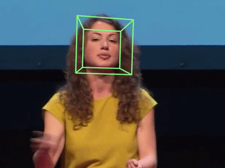

# Head pose estimation

Real time human head pose estimation using TensorFlow and OpenCV.





## Running

A video file or a webcam index should be assigned through arguments. If no source provided, the built in webcam will be used by default.

### With video file

For any video format that OpenCV supports (`mp4`, `avi` etc.):

```bash
python3 main.py --video /path/to/video.mp4
```

### With webcam

The webcam index should be provided:

```bash
python3 main.py --cam 0
``` 

## How it works

There are three major steps:

1. Face detection. A face detector is introduced to provide a face bounding box containing a human face. Then the face box is expanded and transformed to a square to suit the needs of later steps.

2. Facial landmark detection. A pre-trained deep learning model take the face image as input and output 68 facial landmarks.

3. Pose estimation. After getting 68 facial landmarks, the pose could be calculated by a mutual PnP algorithm.

## Retrain the model

To retrain the facial landmark detection model, please refer to this series of [posts](https://yinguobing.com/deeplearning/) (in Chinese only). The training code is also open sourced: https://github.com/yinguobing/cnn-facial-landmark


## License
This project is licensed under the MIT License - see the [LICENSE.md](LICENSE.md) file for details

## Acknowledgments
The pre-trained TensorFlow model file is trained with various public data sets which have their own licenses. Please refer to them before using this code.

- 300-W: https://ibug.doc.ic.ac.uk/resources/300-W/
- 300-VW: https://ibug.doc.ic.ac.uk/resources/300-VW/
- LFPW: https://neerajkumar.org/databases/lfpw/
- HELEN: http://www.ifp.illinois.edu/~vuongle2/helen/
- AFW: https://www.ics.uci.edu/~xzhu/face/
- IBUG: https://ibug.doc.ic.ac.uk/resources/facial-point-annotations/

The 3D model of face comes from OpenFace, you can find the original file [here](https://github.com/TadasBaltrusaitis/OpenFace/blob/master/lib/local/LandmarkDetector/model/pdms/In-the-wild_aligned_PDM_68.txt).

The build in face detector comes from OpenCV. 
https://github.com/opencv/opencv/tree/master/samples/dnn/face_detector
